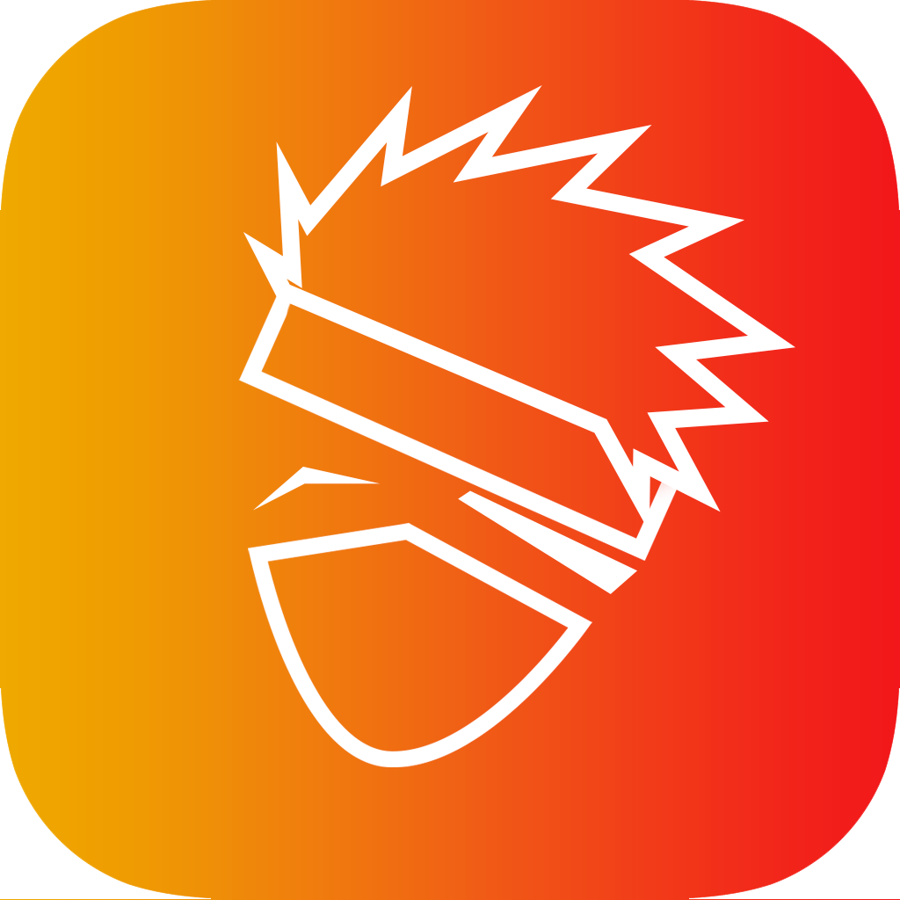

# Ghost-Theme of My Blog 

[](https://github.com/Vanthink-UED/ghost-theme/blob/master/LICENSE)



Final-Naruto is a new version. New features:

+ new silde
+ new nav
+ new SNS part
+ new suggested articles for you

Some Screenshots:


[Preview](http://www.jackpu.com)

### Install

#### Git

``` bash
cd your_ghost_path/content/themes
git clone https://github.com/JackPu/ghost-theme

```
#### Node 
``` bash
npm install vanthink-blog
```
Then restart your ghost. And go to settings to change your theme.

### Thanks

+ [Naruto](https://www.instagram.com/naruto/)

+ [slide](https://tympanus.net/Tutorials/SlidingHeaderLayout/layout-multi.html)


### Copyright & License

Copyright (c) 2013-2015 Ghost Foundation - Released under the MIT License.

Permission is hereby granted, free of charge, to any person obtaining a copy of this software and associated documentation files (the "Software"), to deal in the Software without restriction, including without limitation the rights to use, copy, modify, merge, publish, distribute, sublicense, and/or sell copies of the Software, and to permit persons to whom the Software is furnished to do so, subject to the following conditions:

The above copyright notice and this permission notice shall be included in all copies or substantial portions of the Software.

THE SOFTWARE IS PROVIDED "AS IS", WITHOUT WARRANTY OF ANY KIND, EXPRESS OR IMPLIED, INCLUDING BUT NOT LIMITED TO THE WARRANTIES OF MERCHANTABILITY, FITNESS FOR A PARTICULAR PURPOSE AND
NONINFRINGEMENT. IN NO EVENT SHALL THE AUTHORS OR COPYRIGHT HOLDERS BE LIABLE FOR ANY CLAIM, DAMAGES OR OTHER LIABILITY, WHETHER IN AN ACTION OF CONTRACT, TORT OR OTHERWISE, ARISING FROM, OUT OF OR IN CONNECTION WITH THE SOFTWARE OR THE USE OR OTHER DEALINGS IN THE SOFTWARE.
